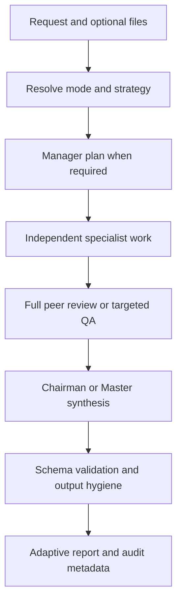
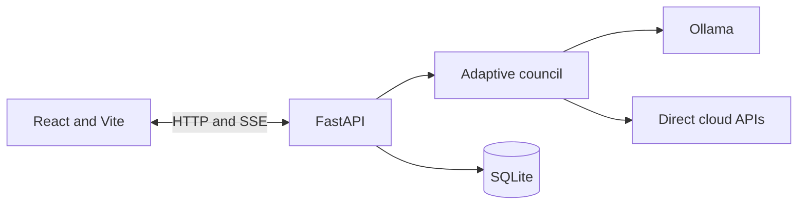

# LLM Council

Current release: **v0.5.0 — Managed Workforce**

LLM Council is a local-first, general-purpose multi-model deliberation app. Use
it to ask questions, review material, debate a proposition, make a decision,
brainstorm ideas, compare alternatives, build a plan, summarise documents, or
assess claims. It is not limited to architecture or code.

Council members can work as an independent panel or as managed specialist
workers. In Workforce and Hybrid strategies, a Manager decomposes the request,
each selected model receives an accountable deliverable, targeted QA challenges
the combined work, and a selected Master reconciles the evidence into a
structured answer with a contribution ledger. Any locally installed Ollama
model can be discovered at runtime, and
local models can be mixed with directly configured OpenAI, Anthropic, Google
Gemini, and xAI APIs. OpenRouter is not used.

## What v0.5.0 adds

- **Three orchestration strategies:** Council, Workforce, and Hybrid.
- **Manager planning:** the selected Master decomposes Workforce and Hybrid
  requests into one bounded assignment per selected model.
- **Accountable worker contracts:** deliverables, success criteria,
  dependencies, claims, evidence, confidence, risks, recommendations, and open
  questions are captured explicitly.
- **Targeted Hybrid QA:** at most two selected models challenge the specialist
  outputs for unsupported claims, conflicts, omissions, and integration gaps.
- **Contribution ledger:** the Master is asked to state which worker
  contributions were used, partially used, or rejected, with reasons.
- **Conservative output hygiene:** invisible carrier characters are inspected
  before evaluation/synthesis and again before display; only a narrow safe set
  is removed by default.
- **No detector-evasion rewrite:** the application does not paraphrase,
  “humanise,” strip file metadata, or claim to prove whether text was written by
  AI.

## What v0.4.0 added

- **Adaptive council modes:** Auto, Ask, Review, Debate, Decide, Brainstorm,
  Compare, Plan, Summarise, and Fact-check.
- **Local automatic routing:** Auto mode selects an approach from the request
  without sending an extra classification request to a provider.
- **Mode-specific perspectives:** each selected model receives a complementary
  role suited to the task.
- **Editable member roles:** override any model's role for the next run and save
  the whole setup as a preset.
- **Mode-aware evaluation:** peer rankings use criteria appropriate to the task,
  rather than treating every response as a technical review.
- **Adaptive Chairman reports:** the final UI shows the relevant combination of
  answers, findings, options, debate positions, ideas, comparisons, plan steps,
  claims, consensus, uncertainty, and next actions.
- **General-purpose regression catalogue:** deterministic cases cover every
  explicit council mode.

The reliability, privacy, observability, document, export, and persistence
features from v0.3 remain in place.

## Council modes

| Mode | Best used for | Chairman output |
|---|---|---|
| Auto | Mixed everyday use | Locally chooses a mode, then uses that mode's output |
| Ask | Questions and explanations | Direct answer, agreement, dissent, uncertainty |
| Review | Critiquing any supplied subject | Findings, evidence, impact, recommendation, verdict |
| Debate | Testing competing positions | Steelmanned positions, weaknesses, balanced conclusion |
| Decide | Choosing between alternatives | Options, trade-offs, risks, recommendation |
| Brainstorm | Generating diverse possibilities | Idea clusters, value, considerations, next steps |
| Compare | Consistent side-by-side analysis | Strengths, weaknesses, best fit, contextual recommendation |
| Plan | Turning a goal into action | Ordered steps, outcomes, dependencies, next actions |
| Summarise | Consolidating text or files | Key points, themes, gaps, open questions |
| Fact-check | Assessing supplied claims | Per-claim verdict, evidence, uncertainty |

Fact-check mode assesses the evidence in the prompt, conversation, selected
documents, and model knowledge. This release does not retrieve live web sources.
If adequate authoritative evidence is absent, the expected verdict is
`unverified`, not confirmation.

Review mode retains optional General, HLD, LLD, Code, and Security profiles.
Those are specialist tools inside the broader council, not the product's main
boundary.

## Orchestration strategies

Task mode and orchestration strategy are separate. A mode such as Review,
Decide, or Plan describes the outcome; the strategy describes how models
collaborate.

| Strategy | Collaboration pattern | Approximate calls for N models |
|---|---|---|
| Council | N independent complete answers, N anonymous peer evaluations, one Chairman synthesis | `2N + 1` |
| Workforce | One Manager plan, N specialist deliverables, one Master synthesis | `N + 2` |
| Hybrid | One Manager plan, N specialist deliverables, up to two targeted QA reviews, one Master synthesis | `N + 4` |

The first turn can add one title call. Chunked documents and provider retries
add calls. Hybrid is the recommended default in the UI; API clients that omit
`orchestration_strategy` retain the earlier `council` behaviour.

## How a council run works



## Main features

- Runtime discovery of locally downloaded Ollama models
- Direct OpenAI, Anthropic, Google Gemini, and xAI clients
- Configurable council membership, Manager/Master, task mode, orchestration
  strategy, context, and per-model role constraints
- Managed workforce plans with bounded worker assignments and targeted Hybrid QA
- Structured worker claims, evidence, confidence, risks, recommendations, and
  open questions
- Master contribution ledger for selection and rejection traceability
- Conservative output-hygiene reports stored with worker, QA, and final output
- Diagnosed provider errors with cause and fix guidance, selective retries,
  timeouts, and privacy-safe logs
- Stream guard when every Stage 1 model fails
- Cancellable, idempotent runs with persisted failure state and safe retry
- Live per-model started, retrying, completed, and failed events
- Clickable model nodes with timings, attempts, errors, and reported token usage
- Side-by-side individual response comparison
- Findings, consensus, and adaptive mode-specific dashboards
- TXT, Markdown, source code, JSON, YAML, TOML, CSV, SQL, XML, HTML, CSS, PDF,
  and DOCX uploads
- Bounded, overlapping document chunks with per-model map/reduce processing
- SQLite conversations, messages, extracted text, and legacy JSON migration
- Explicit confirmation before cloud or remote-Ollama processing
- Approximate source-token and model-call estimates
- Provider status view with privacy-safe connectivity tests
- Built-in and user-saved council presets
- Conversation search, rename, delete, retry, and Markdown, DOCX, or PDF export
- Backend and frontend test suites with GitHub Actions CI

## Architecture



The backend defaults to `http://127.0.0.1:8001`. The Vite development UI
normally runs at `http://localhost:5173`.

## Project structure

```text
LLM_council/
├── backend/
│   ├── config.py            # Environment settings and safety limits
│   ├── council.py           # Three-stage orchestration and adaptive reports
│   ├── council_modes.py     # Modes, local routing, and member roles
│   ├── documents.py         # Extraction and bounded chunking
│   ├── errors.py            # Provider error diagnosis, causes, and fixes
│   ├── evaluations.py       # General-purpose regression catalogue
│   ├── main.py              # FastAPI routes and SSE stream
│   ├── orchestration.py     # Council, Workforce, and Hybrid strategies
│   ├── output_hygiene.py    # Conservative Unicode inspection and cleanup
│   ├── providers.py         # Direct provider clients, retries, and events
│   ├── review_profiles.py   # Optional specialist review profiles
│   └── storage.py           # SQLite persistence and JSON migration
├── frontend/
│   ├── src/                 # React UI, adaptive panels, presets, and exports
│   └── test/                # Frontend unit tests
├── tests/                   # Backend unit and integration tests
├── .env.example
├── pyproject.toml
└── README.md
```

## Requirements

- Python 3.10 or newer
- Node.js 20 or newer and npm
- Conda or another Python environment manager
- Ollama if local models will be used
- API credentials only for cloud providers you deliberately enable

## Install with Conda

Clone the repository and enter it:

```bash
git clone https://github.com/mltakeover/LLM_council.git
cd LLM_council
```

Create and activate an environment:

```bash
conda create -n LLM_Council python=3.12 -y
conda activate LLM_Council
```

Install the backend and frontend:

```bash
python -m pip install --upgrade pip
python -m pip install -e .

cd frontend
npm ci
cd ..
```

Create your local configuration:

```bash
cp .env.example .env
```

`.env` is ignored by Git. You can verify that before committing:

```bash
git check-ignore -v --no-index .env
```

Do not copy `node_modules` between computers or operating systems. If Vite or
esbuild reports a platform mismatch, delete the local `frontend/node_modules`
directory and run `npm ci` from `frontend/` again.

## Local-only Ollama setup

A minimal local configuration is:

```env
COUNCIL_PROVIDERS=ollama
OLLAMA_BASE_URL=http://127.0.0.1:11434/v1/

# Startup fallbacks; the UI discovers installed models dynamically.
OLLAMA_MODELS=llama3.1:latest
OLLAMA_CHAIRMAN_MODEL=llama3.1:latest
TITLE_MODEL=ollama:llama3.1:latest

OLLAMA_MAX_CONCURRENCY=1
REQUEST_TIMEOUT=600
TITLE_TIMEOUT=120
```

Confirm Ollama is available:

```bash
ollama list
```

If it is not already running as a macOS app or service:

```bash
ollama serve
```

Pulling a new model never requires a Python or JavaScript change:

```bash
ollama pull MODEL_NAME
```

Click **Refresh** under **Council Models**. Every locally available model is
discovered from Ollama at runtime. Ollama entries that are cloud-only are shown
but are not treated as local selectable models.

Only loopback Ollama URLs (`localhost`, `127.0.0.1`, or `::1`) are classified as
local. A LAN or internet-hosted `OLLAMA_BASE_URL` is labelled **Remote** and
requires the same confirmation as a cloud model.

## Optional direct cloud providers

Configure only providers and models you intend to use:

```env
OPENAI_API_KEY=
ANTHROPIC_API_KEY=
GEMINI_API_KEY=
XAI_API_KEY=

OPENAI_MODEL=your-openai-model-id
ANTHROPIC_MODEL=your-anthropic-model-id
GEMINI_MODEL=your-gemini-model-id
XAI_MODEL=your-xai-model-id

COUNCIL_PROVIDERS=ollama,openai,anthropic,google,xai
CHAIRMAN_PROVIDER=ollama
```

Blank and obvious placeholder keys are treated as unconfigured. Restart the
backend after changing `.env`, then refresh models in the sidebar.

| Provider | Credential | Client |
|---|---|---|
| Ollama | None for local use | Local OpenAI-compatible endpoint |
| OpenAI | `OPENAI_API_KEY` | OpenAI SDK |
| Anthropic | `ANTHROPIC_API_KEY` | Anthropic SDK |
| Google | `GEMINI_API_KEY` or `GOOGLE_API_KEY` | Google GenAI SDK |
| xAI | `XAI_API_KEY` | xAI OpenAI-compatible endpoint |

Model availability and provider data controls can change. Use model IDs valid
for your account and confirm the current retention and training settings for
each provider you enable.

## Reliability, limits, and storage

Optional `.env` settings and their defaults include:

```env
PROVIDER_MAX_ATTEMPTS=3
PROVIDER_RETRY_BASE_SECONDS=1
PROVIDER_RETRY_MAX_SECONDS=8
PROVIDER_RETRY_AFTER_MAX_SECONDS=30
LOG_PROVIDER_MESSAGES=false

MAX_COUNCIL_MODELS=8
MAX_PROMPT_CHARACTERS=100000
MAX_CONTEXT_CHARACTERS=60000

MAX_DOCUMENTS_PER_MESSAGE=5
UPLOAD_MAX_BYTES=20971520
DOCUMENT_CHUNK_CHARACTERS=12000
DOCUMENT_CHUNK_OVERLAP=500
MAX_DOCUMENT_CHUNKS=12

DATABASE_PATH=data/llm_council.db
APP_HOST=127.0.0.1
```

Retries are limited to failures a retry could actually fix: timeouts,
connection failures, rate limits, empty responses, and common provider 5xx
responses. Authentication, exhausted quota, unknown models, oversized inputs,
content-filter blocks, and invalid requests fail immediately.

Rate limits and exhausted quota both arrive as HTTP 429, so the provider's
message body is inspected before the status code is trusted. Retrying a billing
failure can never succeed, and treating it as a rate limit only delays a clear
answer by the full backoff period.

`Retry-After` is a minimum the provider is asking for, so it is honoured in full
rather than shortened to the local backoff ceiling. Plain seconds, HTTP-dates and
compound durations such as `1m30s` are all accepted. If the requested wait
exceeds `PROVIDER_RETRY_AFTER_MAX_SECONDS` (default 30), the call fails
immediately and reports when it may be retried, rather than stalling every other
council seat.

Every failure carries a machine-readable `code`, a plain-English `cause`, and a
`fix` naming the setting to change. Logs contain bounded operational details,
not prompts, API keys, document contents, or full provider responses.

## Output hygiene boundary

Each run can select one of three output-hygiene modes:

| Mode | Behaviour |
|---|---|
| `clean_safe` | Inspect output and remove only the conservative safe set of non-rendering carrier characters |
| `report` | Record the same findings but leave output unchanged |
| `off` | Skip inspection and cleanup |

The safe set currently covers soft hyphens, zero-width spaces, word joiners,
invisible mathematical separators, and embedded BOM characters. Script
joiners, bidirectional controls, Unicode tag characters, variation selectors,
unusual spaces, and emoji-related characters are not changed automatically.
They are either reported or left untouched because they can be legitimate.

This feature is output hygiene, not an AI detector. It does not infer
authorship, remove statistical token-sampling watermarks, rewrite prose,
“humanise” text, or strip C2PA/EXIF/document metadata. Original provider output
is retained in the stored stage result only when conservative cleaning changed
it, so the transformation remains auditable.

## Run the app

Use two terminals from the repository root.

Backend:

```bash
conda activate LLM_Council
python -m uvicorn backend.main:app --reload --port 8001
```

Frontend:

```bash
cd frontend
npm run dev
```

Open the URL printed by Vite, normally `http://localhost:5173`.

The backend health response is at `http://127.0.0.1:8001/`; interactive API
documentation is at `http://127.0.0.1:8001/docs`.

## Use the UI

1. Create a conversation.
2. Select one to eight models and choose the Chairman/Master.
3. Select Council, Workforce, or Hybrid orchestration. Hybrid is recommended.
4. Select **Auto** or an explicit task mode.
5. In Review mode, optionally choose a specialist review profile.
6. Optionally give models role constraints. In Workforce and Hybrid these are
   preserved by the Manager when it creates assignments.
7. Select output-hygiene behaviour and choose whether recent conversation
   context should be included.
8. Optionally upload and select up to five documents.
9. If cloud or remote processing is involved, read and accept the privacy
   confirmation.
10. Check the approximate usage estimate, then send.
11. Follow the Manager, workers, QA, and Master in the live flow; click a node
    for timing, attempts,
    errors, and reported token usage.
12. Compare specialist outputs and inspect the adaptive report, contribution
    ledger, and hygiene findings.
13. Save useful setups as presets or export the conversation.

Selected files remain in the conversation until deleted. Long files are split
into bounded, overlapping chunks. Each model analyses the chunks and
consolidates its own notes before peer evaluation or targeted QA. Files beyond
`MAX_DOCUMENT_CHUNKS` are marked as truncated; only stored chunks are processed.

## Example requests

Ask:

```text
Explain why inflation can remain high after energy prices stop rising. Separate
well-established mechanisms from disputed explanations.
```

Decide:

```text
Help me choose between buying and leasing a car for 8,000 miles a year. Define
the assumptions and show which changes would reverse the recommendation.
```

Brainstorm:

```text
Generate distinctive ideas for a community event with a £1,000 budget, then
group them by audience and identify the three most feasible concepts.
```

Plan:

```text
Create a six-month plan to reach conversational Spanish, with weekly outcomes,
dependencies, failure risks, and the first three actions.
```

Fact-check:

```text
Assess each claim in the attached document. Mark claims unverified whenever the
available evidence is not sufficient and list the sources still needed.
```

Review remains available for designs, code, contracts, essays, policies,
proposals, plans, and other material.

## Data handling and privacy

- The app binds to loopback by default and does not use OpenRouter.
- Prompts and selected extracted document text are sent only to the models
  selected for that run.
- Non-local council models require explicit confirmation before processing.
- If a non-local title model is configured, it receives the prompt, but not
  selected document text, only after the same confirmation.
- Direct API access does not itself guarantee a retention or training policy;
  provider product, contract, and account settings govern those controls.
- OpenAI calls set `store=False`; other SDK calls use their direct API defaults.
- Original uploaded bytes are not retained. Extracted text, chunks, messages,
  outputs, and run state are stored in local SQLite at `DATABASE_PATH`.
- Workforce plans, worker contracts, targeted QA, contribution ledgers, and
  output-hygiene findings are stored in the assistant turn metadata.
- A UUID `run_id` makes failed and cancelled requests safely retryable without
  duplicating messages.
- Deleting a conversation cascades to its messages and extracted documents.
- `.env`, databases, legacy conversation files, dependencies, IDE files, and
  build outputs are ignored by Git.
- Uploaded content and model output are labelled as untrusted evidence in
  prompts. This reduces prompt-injection risk but does not eliminate it.

On first SQLite initialisation, valid conversations under
`data/conversations/` are imported idempotently. The source JSON files are not
deleted; keep a backup until you verify the migration.

## API summary

| Method | Path | Purpose |
|---|---|---|
| `GET` | `/` | Health and release version |
| `GET` | `/api/council-modes` | Modes, objectives, criteria, and default roles |
| `GET` | `/api/orchestration-strategies` | Council, Workforce, and Hybrid collaboration patterns |
| `GET` | `/api/evaluations/catalog` | General-purpose regression catalogue |
| `GET` | `/api/review-profiles` | Optional specialist review profiles |
| `GET` | `/api/models` | Configured cloud and discovered Ollama models |
| `POST` | `/api/models/test` | Privacy-safe model connectivity probe |
| `POST` | `/api/recommend-models` | Mode-aware suggestions from local history |
| `GET/POST` | `/api/conversations` | List or create conversations |
| `GET/PATCH/DELETE` | `/api/conversations/{id}` | Read, rename, or delete a conversation |
| `GET` | `/api/conversations/{id}/runs/{run_id}` | Inspect persisted run state |
| `POST/GET` | `/api/conversations/{id}/documents` | Upload or list documents |
| `DELETE` | `/api/conversations/{id}/documents/{document_id}` | Delete a document |
| `POST` | `/api/conversations/{id}/usage-estimate` | Estimate source tokens and calls |
| `POST` | `/api/conversations/{id}/message` | Run a non-streamed council turn |
| `POST` | `/api/conversations/{id}/message/stream` | Run with SSE progress |

The message endpoints accept `council_mode`, `orchestration_strategy`,
`output_hygiene`, `review_profile`, `role_assignments`, selected models,
Chairman/Master, context choice, document IDs, privacy confirmation, and a UUID
`run_id`. Reusing a run ID with changed inputs returns HTTP 409.

Workflow events include `manager_start`, `manager_complete`, `stage1_start`,
`stage1_complete`, `stage2_start`, `stage2_complete`, `stage3_start`, and
`stage3_complete`. Provider progress events are `model_started`, `model_retrying`,
`model_completed`, and `model_failed`. Terminal stream events are `complete` or
a structured `error`.

A structured error has the shape:

```json
{
  "code": "quota_exhausted",
  "message": "You exceeded your current quota, please check your plan and billing details.",
  "cause": "The account has no remaining credit or has hit a hard spend cap...",
  "fix": "Top up the credit balance or raise the spend cap in the provider's dashboard...",
  "retryable": false,
  "status_code": 429,
  "exception_type": "RateLimitError",
  "retry_after_seconds": null
}
```

`retry_after_seconds` is populated when the provider names a wait, including
when the call was abandoned because that wait was too long.

`code` is stable and safe to branch on. `cause` and `fix` are written for
display to the user. `message` is the provider's own text, unwrapped from its
envelope. Codes are defined in `backend/errors.py`:

| Code | Retryable |
|---|---|
| `rate_limit` | yes |
| `timeout` | yes |
| `connection` | yes |
| `provider_unavailable` | yes |
| `empty_response` | yes |
| `quota_exhausted` | no |
| `authentication` | no |
| `model_not_found` | no |
| `context_length` | no |
| `content_filter` | no |
| `invalid_request` | no |
| `configuration` | no |
| `provider_error` | no |

## Development and tests

Install test tools:

```bash
python -m pip install -e '.[dev]'
```

Run backend checks:

```bash
ruff check backend tests
pytest -q
```

Run frontend checks from `frontend/`:

```bash
npm ci
npm test
npm run lint
npm run build
```

Tests mock provider execution and require neither Ollama nor cloud keys.
`.github/workflows/ci.yml` checks Python 3.10 and 3.12 plus Node 20 for pushes
and pull requests targeting `master`.

The evaluation catalogue checks output shape and mode coverage; it is a
regression harness, not a claim that model answers are factually correct. Model
quality should also be assessed with representative prompts and human scoring.

## Troubleshooting

### The UI cannot reach the backend

```bash
curl -i http://127.0.0.1:8001/
```

If the backend uses another port, start Vite with:

```bash
VITE_API_BASE_URL=http://127.0.0.1:YOUR_PORT npm run dev
```

### A new Ollama model does not appear

```bash
ollama list
curl http://127.0.0.1:11434/api/tags
```

Start Ollama if needed, then click **Refresh**. Cloud-only Ollama entries remain
unselectable as local models.

### A cloud model does not appear

Confirm its key is non-empty, its provider is listed in `COUNCIL_PROVIDERS`, and
its model ID is valid for the account. Restart the backend after `.env` changes.

### Every Stage 1 model fails

The run stops before peer evaluation and returns `all_models_failed`. Open the
model node in the council flow: each failed stage shows the cause, how to fix
it, and the provider's full response behind **Provider response**.

If every model failed with the same code, there is one problem rather than
several — usually a missing key, an unreachable Ollama, or an exhausted account.

### A cloud model fails with `quota_exhausted`

The account has no credit left, or has hit a spend cap. This is not a rate
limit, and it is not retried, because waiting cannot clear it. Top up in the
provider's dashboard, or drop that provider from `COUNCIL_PROVIDERS` and carry
on with the local Ollama models.

### A model fails with `context_length`

The prompt plus attached documents exceeded that model's window. Local models
have far smaller windows than cloud ones, so this usually appears on Ollama
seats first. Lower `MAX_CONTEXT_CHARACTERS` or `MAX_DOCUMENT_CHUNKS`, attach
fewer documents, or give that seat a longer-context model.

### A retry says the run is still active

Cancellation is cooperative. Wait briefly while the backend cancels active
provider work and records the run as cancelled, then retry with the same run ID.
After restart, orphaned running jobs are automatically marked failed.

### Editable install discovers multiple top-level packages

Use the checked-in `pyproject.toml`, whose setuptools discovery includes only
`backend*`, then run:

```bash
python -m pip install -e .
```

### `npm ci` cannot find `package-lock.json`

Run npm commands from the frontend directory:

```bash
cd frontend
npm ci
```

## Limitations and security

- Model output can be wrong, biased, outdated, or fabricated. Important outputs
  require appropriate human judgement and source verification.
- Agreement between models is not proof. Models can share the same blind spots.
- Manager plans and contribution ledgers are model-generated control records;
  they improve traceability but do not independently prove correctness.
- Specialist workers currently execute in parallel. Plan dependencies inform
  the workers and Master but are not sequential worker-to-worker tool hand-offs.
- Output hygiene detects a bounded set of Unicode characters. A clean report is
  not proof that text contains no statistical watermark or AI provenance.
- Fact-check mode has no live browsing or authoritative-source retrieval in
  this release.
- Character-based token estimates omit generated output and provider-specific
  tokenisation details.
- Image-only PDFs require OCR before upload.
- The app has no user authentication and is intended for personal loopback use.
- Do not expose it to a LAN or the public internet without authentication, TLS,
  strict origins, rate limiting, and hardened upload controls.

## Attribution

The three-stage council pattern is inspired by Andrej Karpathy's LLM Council.
This implementation extends it for general-purpose adaptive deliberation,
direct providers, dynamic Ollama discovery, streaming progress, structured
outputs, documents, privacy controls, and local persistence.

The conservative distinction between invisible Unicode hygiene, file metadata,
and statistical watermark rewriting was informed by Guillaume Meyer's
[`watermarks-remover`](https://github.com/guillaumemeyer/watermarks-remover)
project. This repository uses an independently implemented, narrower Unicode
scanner and does not copy its service, detectors, rewriting layer, or metadata
cleaners.
