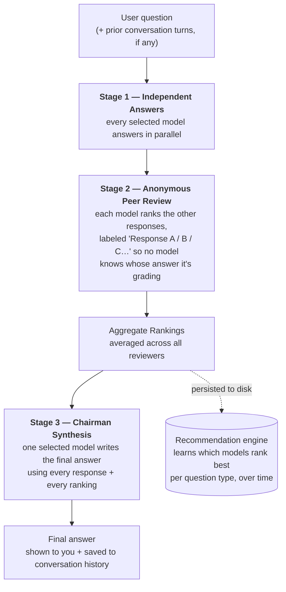
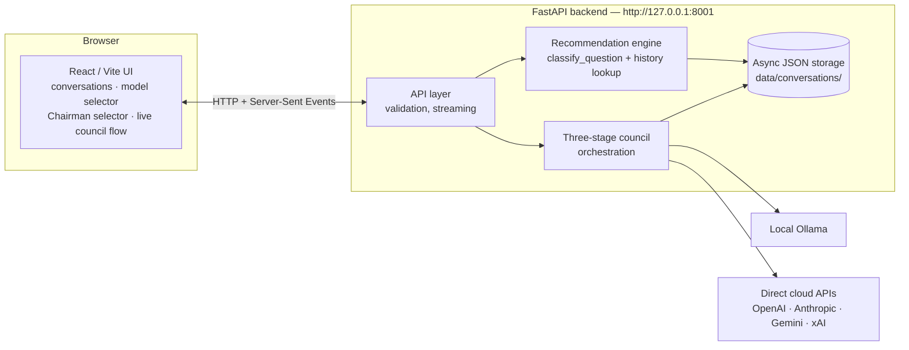

# LLM Council

A local multi-model review application for architecture documents, detailed designs, source code, technical decisions, and general questions.

Multiple LLMs independently answer your question, anonymously peer-review each other's answers, and a Chairman model synthesizes the final response — so no single model's opinion (or bias) determines the answer. Runs entirely on your machine except for whichever cloud providers you explicitly enable.

**OpenRouter is not used.** All cloud calls go directly to the provider's own API.

---

## Table of contents

- [How the council works](#how-the-council-works)
- [Features](#features)
- [Architecture](#architecture)
- [Project structure](#project-structure)
- [Requirements](#requirements)
- [Installation (macOS, Conda)](#installation-macos-conda)
- [Configuration](#configuration)
- [Running the application](#running-the-application)
- [Using the UI](#using-the-ui)
- [Example review prompts](#example-review-prompts)
- [API reference](#api-reference)
- [Data handling and privacy](#data-handling-and-privacy)
- [Troubleshooting](#troubleshooting)
- [Development checks](#development-checks)
- [Known limitations](#known-limitations)
- [Stopping the application](#stopping-the-application)
- [Attribution](#attribution)

---

## How the council works



For **N** selected council models, one turn makes `2N + 1` model calls (N answers + N reviews + 1 synthesis), plus one extra call the first time a conversation is titled. Failed calls, retries, and provider-specific behavior can change the exact count — a failed model is simply excluded from that stage rather than failing the whole request.

Every stage also receives the conversation's prior turns as real context (see [Conversation memory](#features) below), so follow-up questions aren't answered cold.

## Features

- **Three-stage deliberation** — independent answers → anonymous peer review → Chairman synthesis (above)
- **Conversation memory** — follow-up questions carry the full prior conversation into every stage, using each turn's Chairman answer as context
- **Self-learning model recommendations** — as you type a question, if similar past questions exist in your history, the app suggests the models that have actually ranked best for that topic *in your own council's peer review* — never a hardcoded opinion about which model is "best," and it says nothing until there's real data behind it
- **Local models via Ollama** — dynamic model discovery (`ollama pull` a model and it shows up after a refresh, no code changes)
- **Direct cloud provider calls** — OpenAI, Anthropic, Google Gemini, and xAI, each via their own SDK
- **Per-request council & Chairman selection** — pick a different mix of models for any given question
- **Live council flow visualization** — animated Answer → Review → Synthesis progress via server-sent events
- **Per-model response timing** shown next to every response
- **Cancel & retry** — stop an in-flight council run, or retry one that failed
- **Conversation management** — search, rename, and delete conversations
- **Export to Markdown** — download a full conversation (all three stages) as a `.md` file
- **Syntax-highlighted code blocks** with one-click copy, plus a copy button on the final answer
- **Responsive UI** — collapsible sidebar drawer on mobile
- **Local JSON conversation history**, stored under `data/conversations/`

## Architecture



## Project structure

```text
LLM_council/
├── backend/
│   ├── __init__.py
│   ├── main.py            # FastAPI endpoints, request validation, SSE streaming
│   ├── config.py          # Environment and model configuration
│   ├── providers.py       # Cloud provider clients + Ollama discovery
│   ├── council.py         # 3-stage orchestration, classifier, recommendations
│   └── storage.py         # Async, lock-safe local conversation persistence
├── frontend/
│   ├── package.json
│   └── src/
│       ├── App.jsx                    # Top-level state, streamed progress handling
│       ├── api.js                     # Backend API client
│       ├── App.css / index.css
│       ├── components/
│       │   ├── ChatInterface.jsx      # Message list, input, suggestion banner
│       │   ├── CouncilFlow.jsx        # Live Answer/Review/Synthesis visualization
│       │   ├── Sidebar.jsx            # Model selector + conversation list
│       │   ├── Stage1.jsx / Stage2.jsx / Stage3.jsx
│       │   ├── Markdown.jsx           # Shared renderer: syntax highlight + copy
│       │   └── CopyButton.jsx
│       └── utils/
│           ├── modelDisplay.js        # provider:model-name formatting
│           └── exportConversation.js  # Markdown export
├── data/
│   └── conversations/     # Created automatically, one JSON file per conversation
├── .env                   # Local configuration and secrets (not committed)
├── .env.example           # Safe configuration template
├── .gitignore
├── pyproject.toml
└── README.md
```

## Requirements

- macOS
- Conda or Miniconda
- Python 3.10+
- Node.js and npm
- [Ollama](https://ollama.com) for local models
- API credentials, only for whichever cloud providers you choose to enable

Check what's installed:

```bash
conda --version
python --version
node --version
npm --version
ollama --version
```

## Installation (macOS, Conda)

### 1. Get the project

```bash
git clone https://github.com/mltakeover/LLM_council.git
cd LLM_council
```

If you already have it cloned, just `cd` into the repo root — all commands below assume you're there.

### 2. Create the environment

```bash
conda create -n LLM_Council python=3.11 -y
conda activate LLM_Council
```

### 3. Install the backend

The repo's `pyproject.toml` already excludes the `frontend/` directory from Python packaging (`[tool.setuptools.packages.find]` only includes `backend*`), so this is a normal editable install:

```bash
python -m pip install --upgrade pip
python -m pip install -e .
```

Verify it worked:

```bash
python -c "import backend, openai, anthropic; from google import genai; print('Backend dependencies installed')"
```

### 4. Install the frontend

```bash
cd frontend
npm install
cd ..
```

## Configuration

### Local Ollama (recommended starting point)

Create `.env` in the project root:

```env
COUNCIL_PROVIDERS=ollama

OLLAMA_BASE_URL=http://127.0.0.1:11434/v1/
OLLAMA_MODELS=qwen3.6:latest,qwen2.5-coder:7b,llama3.1:latest
OLLAMA_CHAIRMAN_MODEL=qwen3.6:latest
TITLE_MODEL=ollama:llama3.1:latest

OLLAMA_MAX_CONCURRENCY=1
OLLAMA_DISCOVERY_TIMEOUT=5
REQUEST_TIMEOUT=600
TITLE_TIMEOUT=120
```

`OLLAMA_MODELS` only sets the *initial* defaults — it's not an allowlist. The UI reads the live catalogue straight from Ollama, so a newly-pulled model just needs a **Refresh** click in the sidebar.

Make sure Ollama is actually running:

```bash
ollama list          # should succeed without error
ollama serve          # only if nothing is listening on 11434 yet
```

Don't run a second `ollama serve` if the macOS Ollama app already has the service running.

**Adding a new local model:** `ollama pull MODEL_NAME`, then in the UI: expand **Council Models** → **Refresh** → select it. No backend restart needed — selections persist in the browser's local storage. Ollama entries tagged as *cloud* models show up but stay disabled, so the "local" selector can't accidentally present a remote call as local processing.

### Direct cloud providers (optional)

Add credentials only for what you intend to use:

```env
OPENAI_API_KEY=replace-with-a-real-key
ANTHROPIC_API_KEY=replace-with-a-real-key
GEMINI_API_KEY=replace-with-a-real-key
XAI_API_KEY=replace-with-a-real-key

OPENAI_MODEL=your-valid-openai-model-id
ANTHROPIC_MODEL=your-valid-claude-model-id
GEMINI_MODEL=your-valid-gemini-model-id
XAI_MODEL=your-valid-grok-model-id

COUNCIL_PROVIDERS=ollama,openai,anthropic,google,xai
CHAIRMAN_PROVIDER=ollama
```

Model identifiers must be valid for your account — model names and availability change over time, so this README deliberately doesn't hardcode a "current" model to point at.

| Provider value | Credential | Model setting | Connection |
|---|---|---|---|
| `ollama` | none | selected in the UI | local Ollama API |
| `openai` | `OPENAI_API_KEY` | `OPENAI_MODEL` | OpenAI SDK |
| `anthropic` | `ANTHROPIC_API_KEY` | `ANTHROPIC_MODEL` | Anthropic SDK |
| `google` | `GEMINI_API_KEY` or `GOOGLE_API_KEY` | `GEMINI_MODEL` | Google GenAI SDK |
| `xai` | `XAI_API_KEY` | `XAI_MODEL` | xAI (OpenAI-compatible API) |

**Why a cloud model might not appear:** the backend only exposes a provider once it detects a real-looking key — placeholder-ish values like `your-openai-key` or a blank string are treated as *not configured*. After adding real credentials: stop Uvicorn (`Ctrl+C`), restart it, then click **Refresh** in the sidebar. `--reload` does not pick up `.env` changes.

`COUNCIL_PROVIDERS` only controls the *initial default* council — a configured cloud model can still be selected manually even if it isn't in that list.

**Never paste API keys into chat, source code, screenshots, or documentation.**

### Protect secrets and local data

At minimum, `.gitignore` should contain:

```gitignore
.env
.env.*
!.env.example
__pycache__/
*.py[cod]
.DS_Store
frontend/node_modules/
data/conversations/
```

Never commit `.env`. If a key leaks, revoke it in the provider's dashboard and issue a replacement.

## Running the application

Run the backend and frontend in separate terminals.

**Terminal 1 — backend**

```bash
conda activate LLM_Council
cd /path/to/LLM_council

python -m uvicorn backend.main:app --reload --host 127.0.0.1 --port 8001
```

The frontend expects port **8001** — Uvicorn's default is 8000, so leaving off `--port 8001` will break the connection. You should see:

```text
Uvicorn running on http://127.0.0.1:8001
Application startup complete.
```

**Terminal 2 — frontend**

```bash
cd frontend
npm run dev
```

Open the URL Vite prints (usually `http://localhost:5173` — it'll pick 5174 or another port if 5173 is busy; the backend's CORS config accepts any local `localhost`/`127.0.0.1` port).

## Using the UI

1. Start Ollama (if using local models), then the backend, then the frontend.
2. Click **New Conversation**.
3. Expand **Council Models**, select one or more.
4. Choose a **Chairman** from the selected models.
5. Type your question and submit — if a similar past question exists, you may see a model suggestion banner first.

The live flow panel shows each stage as **Waiting → In progress → Completed / Failed**, then connects the results into the Chairman's synthesis. Collapse it any time with **Hide flow**.

## Example review prompts

**HLD review**
```text
Review this HLD as a technical design authority. Identify architectural gaps,
security risks, scalability concerns, missing non-functional requirements,
assumptions, dependencies and open questions. Separate confirmed findings from
recommendations and prioritise the findings by severity.
```

**LLD review**
```text
Review this LLD for correctness, maintainability, resilience, security,
observability and operational support. Provide prioritised findings with
evidence, impact and recommended remediation.
```

**Code review**
```text
Review this code for functional defects, security weaknesses, concurrency risks,
error-handling gaps, test gaps and unnecessary complexity. Do not claim a defect
unless it is supported by the supplied code.
```

## API reference

Interactive docs: **http://127.0.0.1:8001/docs**

| Method | Path | Purpose |
|---|---|---|
| `GET` | `/` | Health check |
| `GET` | `/api/models` | Discovered Ollama models + configured cloud models |
| `POST` | `/api/recommend-models` | Suggest models for a question, from past peer-review history |
| `GET` | `/api/conversations` | List conversations (metadata only) |
| `POST` | `/api/conversations` | Create a conversation |
| `GET` | `/api/conversations/{id}` | Full conversation, all stages |
| `PATCH` | `/api/conversations/{id}` | Rename |
| `DELETE` | `/api/conversations/{id}` | Delete |
| `POST` | `/api/conversations/{id}/message` | Run the council, return all stages at once |
| `POST` | `/api/conversations/{id}/message/stream` | Same, streamed via SSE |

Quick checks:

```bash
curl http://127.0.0.1:8001/
# {"status":"ok","service":"LLM Council API"}

curl -s http://127.0.0.1:8001/api/models | python -m json.tool

curl -i -X POST http://127.0.0.1:8001/api/conversations \
  -H "Content-Type: application/json" -d '{}'
```

## Data handling and privacy

- **Local Ollama models:** request path is `Browser → local FastAPI backend → local Ollama service` — nothing leaves your machine.
- **Cloud models:** request path is `Browser → local FastAPI backend → selected cloud provider`. Removing OpenRouter removes that intermediary, but it does **not** make cloud requests local, and it doesn't by itself establish any retention or training policy — check each provider's current terms before sending confidential HLDs, LLDs, source code, or personal/client data.
- Conversation history is stored **unencrypted** under `data/conversations/`. Protect the machine, project directory, and any backups accordingly.

## Troubleshooting

<details>
<summary><strong>Cloud models don't appear</strong></summary>

```bash
python -c "from backend.config import AVAILABLE_CLOUD_MODELS; print(AVAILABLE_CLOUD_MODELS)"
```

If this prints `[]`: confirm `.env` is in the project root next to `pyproject.toml`, replace placeholder keys with real ones, start Uvicorn from the project root, fully restart it (not `--reload`), then click **Refresh** in the UI.
</details>

<details>
<summary><strong>Ollama models don't appear</strong></summary>

```bash
ollama list
curl http://127.0.0.1:11434/api/tags
curl -s http://127.0.0.1:8001/api/models | python -m json.tool
```

If Ollama works but the last command doesn't reflect it, check `OLLAMA_BASE_URL`, restart the backend, and check its terminal output.
</details>

<details>
<summary><strong>"New Conversation" does nothing</strong></summary>

```bash
curl -i -X POST http://127.0.0.1:8001/api/conversations \
  -H "Content-Type: application/json" -d '{}'
```

If this can't connect, start the backend on port 8001. If it succeeds but the button still doesn't work: confirm `frontend/src/api.js` (or `VITE_API_BASE_URL`) points at `http://localhost:8001`, then check the browser console (`Cmd+Option+I`) and the Network tab for the failing request.
</details>

<details>
<summary><strong>ModuleNotFoundError: No module named 'backend.providers'</strong></summary>

```bash
python -c "import backend.providers; print(backend.providers.__file__)"
```

Confirm `backend/providers.py` exists and that `backend/council.py` imports from it (`from .providers import query_models_parallel, query_model`).
</details>

<details>
<summary><strong>"Multiple top-level packages discovered" during install</strong></summary>

Confirm `pyproject.toml` has:
```toml
[tool.setuptools.packages.find]
where = ["."]
include = ["backend*"]
exclude = ["frontend*"]
```
then rerun `python -m pip install -e .`
</details>

<details>
<summary><strong>Relative-import error</strong></summary>

Don't run `python backend/main.py` directly. Run it as a module instead:
```bash
python -m backend.main
# or
python -m uvicorn backend.main:app --reload --port 8001
```
</details>

<details>
<summary><strong>Provider returns 401 / 403</strong></summary>

Check the key in `.env` (without printing the full value), confirm the account can access the configured model, confirm the model identifier is correct for that provider, restart the backend after any `.env` change, and check the provider account's billing/credit status.
</details>

<details>
<summary><strong>Provider returns 429</strong></summary>

That's a rate limit or exhausted quota — check the provider's error and dashboard. Selecting fewer council members reduces call volume but doesn't restore exhausted credit.
</details>

<details>
<summary><strong>A large local council is slow</strong></summary>

Every selected Ollama model is called during both the Answer and Review stages, and large models may need to load/unload between calls. Start with two local models and keep `OLLAMA_MAX_CONCURRENCY=1`; raise it only after checking memory headroom and stability.
</details>

## Development checks

```bash
# Syntax
python -m compileall backend

# Imports
python -c "import backend.main, backend.council, backend.providers; print('Backend imports OK')"

# Configured models (no secrets printed)
python -c "from backend.config import COUNCIL_MODELS, CHAIRMAN_MODEL; print('Council:', COUNCIL_MODELS); print('Chairman:', CHAIRMAN_MODEL)"

# Frontend dev server
cd frontend && npm run dev

# Frontend build + lint
cd frontend && npm run build && npm run lint
```

## Known limitations

- Intended for local development and personal use — **no authentication or multi-user authorization**.
- Local conversation JSON files are **not encrypted**.
- A provider or model can fail while the rest of the council continues (graceful degradation).
- Council consensus is not proof of correctness — several models can repeat the same wrong assumption.
- Architecture and code-review findings still need human validation.
- **Do not expose the backend publicly** without adding authentication, TLS, network controls, stricter CORS, request limits, and proper secret management.

## Stopping the application

`Ctrl+C` in both the frontend and backend terminals. Quit the Ollama app separately if it shouldn't keep running locally.

## Attribution

Based on [Andrej Karpathy's original LLM Council project](https://github.com/karpathy/llm-council). The direct cloud provider adapters, Ollama integration, dynamic model selector, conversation memory, model recommendations, and live council flow are local modifications. Review the upstream project's current license before redistributing a modified version — this README does not replace it.

**Reference docs:** [Ollama API](https://github.com/ollama/ollama/blob/main/docs/api.md) · [OpenAI API](https://platform.openai.com/docs) · [Anthropic API](https://docs.anthropic.com) · [Google Gemini API](https://ai.google.dev/gemini-api/docs) · [xAI API](https://docs.x.ai) · [FastAPI](https://fastapi.tiangolo.com) · [Setuptools package discovery](https://setuptools.pypa.io/en/latest/userguide/package_discovery.html)
