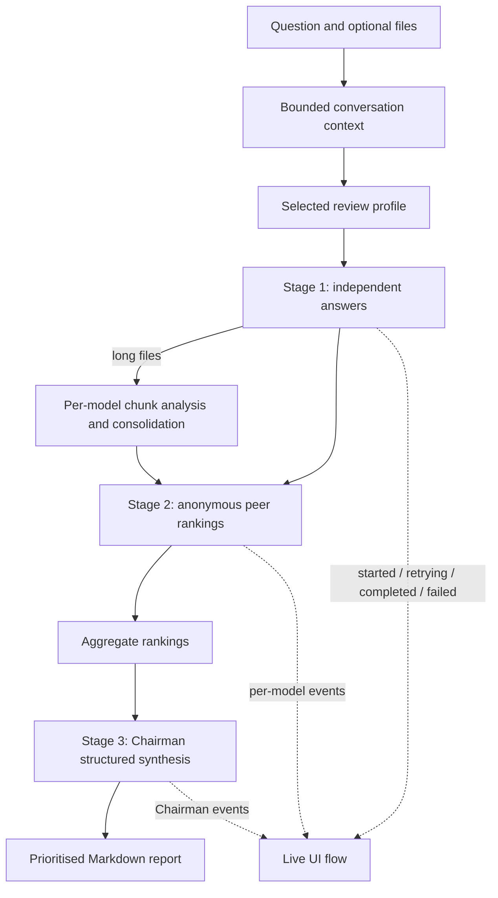
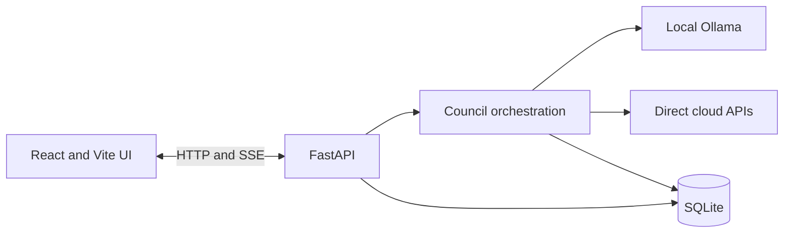

# LLM Council

Current release: **v0.3.1 — Reliability & Privacy**

A local-first multi-model review application for high-level designs (HLDs),
low-level designs (LLDs), code, security reviews, technical decisions, and
general questions.

Council members answer independently, anonymously review one another, and a
selected Chairman produces a structured final report. Local Ollama models and
direct cloud provider APIs can be mixed in the same council. OpenRouter is not
used.

## What is included

- Dynamic discovery of every locally installed Ollama model
- Direct OpenAI, Anthropic, Google Gemini, and xAI clients
- Configurable council membership and Chairman, with an eight-model default limit
- General, HLD, LLD, code, and security review profiles
- Bounded conversation context for useful follow-up questions
- Live per-model started, retrying, completed, and failed events
- Clickable council nodes with stage timing, attempts, errors, and reported tokens
- Side-by-side council response comparison
- Structured provider errors, timeouts, exponential backoff, and safe logging
- A guard that stops the stream if every Stage 1 model fails
- Cancellable provider tasks plus persisted, idempotent run IDs and retry states
- Structured Chairman findings with severity, evidence, impact, and remediation
- Filterable findings dashboard plus semantic consensus and ranking agreement
- TXT, Markdown, source code, JSON, YAML, TOML, CSV, SQL, XML, HTML, CSS, PDF,
  and DOCX uploads
- Bounded overlapping chunks and per-model map/reduce review for long documents
- SQLite conversations, messages, document text, and automatic legacy JSON import
- Pre-send cloud-processing confirmation and approximate input/call estimates
- Explicit remote-Ollama and cloud-title privacy handling
- Provider status screen with privacy-safe connectivity tests
- Built-in and user-saved council presets
- Conversation search, rename, delete, retry, and Markdown, DOCX, or PDF export
- Backend and frontend test suites with GitHub Actions CI

## How the council works



With `N` council models and no long document, a normal turn uses approximately
`2N + 1` calls: `N` answers, `N` peer reviews, and one Chairman synthesis. A
first turn can make one additional title call. Long-document chunk analysis and
retries add calls. The UI shows a pre-send estimate.

## Architecture



The backend defaults to `http://127.0.0.1:8001`; the Vite development UI
defaults to `http://localhost:5173`.

## Project structure

```text
LLM_council/
├── backend/
│   ├── config.py            # Environment settings and safety limits
│   ├── council.py           # Three-stage orchestration and reports
│   ├── documents.py         # Extraction and bounded chunking
│   ├── main.py              # FastAPI routes and SSE stream
│   ├── providers.py         # Direct provider clients, retries, and events
│   ├── review_profiles.py   # Built-in review modes and reviewer roles
│   └── storage.py           # SQLite persistence and JSON migration
├── frontend/
│   ├── src/                 # React UI, dashboards, presets, status, exports
│   └── test/                # Frontend unit tests
├── tests/                   # Backend unit and integration tests
├── .env.example
├── pyproject.toml
└── README.md
```

## Requirements

- Python 3.10 or newer
- Node.js 20 or newer and npm
- Conda or another Python environment manager
- Ollama for local models
- API credentials only for cloud providers you deliberately enable

## Installation with Conda

Clone and enter the repository:

```bash
git clone https://github.com/mltakeover/LLM_council.git
cd LLM_council
```

Create and activate the environment:

```bash
conda create -n LLM_Council python=3.12 -y
conda activate LLM_Council
```

Install the backend and frontend:

```bash
python -m pip install --upgrade pip
python -m pip install -e .

cd frontend
npm ci
cd ..
```

Copy the safe environment template:

```bash
cp .env.example .env
```

The `.env` file is ignored by Git. Confirm before committing:

```bash
git check-ignore -v --no-index .env
```

## Local Ollama configuration

Start with a local-only `.env`:

```env
COUNCIL_PROVIDERS=ollama
OLLAMA_BASE_URL=http://127.0.0.1:11434/v1/

# Startup defaults only; the UI discovers all installed models dynamically.
OLLAMA_MODELS=qwen2.5-coder:7b,llama3.1:latest
OLLAMA_CHAIRMAN_MODEL=llama3.1:latest
TITLE_MODEL=ollama:llama3.1:latest

OLLAMA_MAX_CONCURRENCY=1
REQUEST_TIMEOUT=600
TITLE_TIMEOUT=120
```

Confirm Ollama is available:

```bash
ollama list
```

If Ollama is not already running as a macOS application or service:

```bash
ollama serve
```

Pulling another model does not require a code change:

```bash
ollama pull MODEL_NAME
```

Click **Refresh** under **Council Models** in the UI. The model appears
automatically. Ollama entries marked as cloud-only are shown but are not treated
as local selectable models.

Only loopback Ollama URLs (`localhost`, `127.0.0.1`, or `::1`) are classified as
local. A LAN or internet-hosted `OLLAMA_BASE_URL` remains selectable, is labelled
**Remote**, and requires the same confirmation as a direct cloud model.

## Optional direct cloud providers

Add only the credentials and model IDs you intend to use:

```env
OPENAI_API_KEY=
ANTHROPIC_API_KEY=
GEMINI_API_KEY=
XAI_API_KEY=

OPENAI_MODEL=your-openai-model-id
ANTHROPIC_MODEL=your-anthropic-model-id
GEMINI_MODEL=your-gemini-model-id
XAI_MODEL=your-xai-model-id

COUNCIL_PROVIDERS=ollama,openai,anthropic,google,xai
CHAIRMAN_PROVIDER=ollama
```

Blank and obvious placeholder keys are treated as unconfigured. Restart the
backend after changing `.env`, then refresh models in the sidebar.

| Provider | Key | SDK or protocol |
|---|---|---|
| Ollama | None | Local OpenAI-compatible endpoint |
| OpenAI | `OPENAI_API_KEY` | OpenAI SDK |
| Anthropic | `ANTHROPIC_API_KEY` | Anthropic SDK |
| Google | `GEMINI_API_KEY` or `GOOGLE_API_KEY` | Google GenAI SDK |
| xAI | `XAI_API_KEY` | xAI OpenAI-compatible endpoint |

Model availability and exact provider retention controls change over time. Use
a valid model ID for your own account and review the provider's current API data
controls.

## Reliability, limits, and storage settings

These optional `.env` settings have safe defaults:

```env
PROVIDER_MAX_ATTEMPTS=3
PROVIDER_RETRY_BASE_SECONDS=1
PROVIDER_RETRY_MAX_SECONDS=8

MAX_COUNCIL_MODELS=8
MAX_PROMPT_CHARACTERS=100000
MAX_CONTEXT_CHARACTERS=60000

MAX_DOCUMENTS_PER_MESSAGE=5
UPLOAD_MAX_BYTES=20971520
DOCUMENT_CHUNK_CHARACTERS=12000
DOCUMENT_CHUNK_OVERLAP=500
MAX_DOCUMENT_CHUNKS=12

DATABASE_PATH=data/llm_council.db
APP_HOST=127.0.0.1
```

Retryable failures include timeouts, connection errors, rate limits, and common
provider 5xx responses. Authentication, unknown-model, and invalid-request
errors fail immediately. Logs include model, stage, attempt, status, and a
bounded error message; secrets are never deliberately logged.

## Run the application

Use two terminals from the repository root.

Terminal 1 — backend:

```bash
conda activate LLM_Council
python -m uvicorn backend.main:app --reload --port 8001
```

Terminal 2 — frontend:

```bash
cd frontend
npm run dev
```

Open the URL printed by Vite, normally `http://localhost:5173`.

The root backend health response is available at
`http://127.0.0.1:8001/`. Interactive API documentation is available at
`http://127.0.0.1:8001/docs`.

## Use the UI

1. Create a conversation.
2. Select one to eight council models.
3. Select a Chairman from the chosen council members.
4. Choose a General, HLD, LLD, Code, or Security review profile.
5. Choose whether recent conversation context should be included.
6. Optionally upload and select up to five documents.
7. If a cloud model, remote Ollama endpoint, or cloud title model is involved,
   read and accept the cloud-processing notice.
8. Review the approximate token and call estimate, then send.
9. Watch each model move through its own live status; click a model or the
   Chairman to inspect timings, attempts, errors, and reported token usage.
10. Use **Compare** for side-by-side answers, then filter the Chairman findings
    and inspect consensus or dissent.
11. Save useful model/profile combinations as council presets. Use **Status**
    to run a generic connectivity check against a model.
12. Export a completed conversation as Markdown, DOCX, or PDF.

Files stay available within their conversation until individually deleted or
the conversation is deleted. Long files are automatically split into bounded,
overlapping chunks. Each selected model reviews the chunks and consolidates its
own notes before anonymous peer review. If a file exceeds `MAX_DOCUMENT_CHUNKS`,
the UI marks it as truncated and the estimate counts only chunks that will
actually be reviewed.

## Review profile examples

HLD:

```text
Review this HLD for trust boundaries, scalability, resilience, data ownership,
integration risks, operability, cost assumptions, and unresolved decisions.
Separate confirmed findings from assumptions and open questions.
```

LLD:

```text
Review this LLD for component responsibilities, interface and data contracts,
failure handling, concurrency, deployment, observability, and testability.
```

Code:

```text
Review the uploaded code for functional defects, security issues, concurrency,
error handling, performance, maintainability, and missing tests. Cite exact
evidence and avoid speculative findings.
```

## Data handling and privacy

- The app binds to loopback by default and does not require OpenRouter.
- Ollama is considered local only when `OLLAMA_BASE_URL` uses an explicit
  loopback host. Remote Ollama endpoints require confirmation before processing.
- Prompts and selected extracted document text are sent to selected non-local
  council models only after explicit confirmation.
- While a conversation still needs its generated title, a non-local
  `TITLE_MODEL` receives the next prompt (but not selected document text) only
  after that same confirmation.
- Direct API access does **not**, by itself, guarantee a particular retention or
  training policy. Those controls are governed by each provider, API product,
  contract, and account configuration.
- OpenAI calls set `store=False`; other SDK calls use their direct API defaults.
  Confirm the current provider settings that apply to your account.
- Original uploaded bytes are not retained. Extracted text, chunks, messages,
  model outputs, and run status are stored in local SQLite at `DATABASE_PATH`.
- Every council submission has a UUID `run_id`. Failed or cancelled runs can be
  retried with the same ID without duplicating the user or assistant message.
- Deleting a conversation cascades to its messages and extracted documents.
- `.env`, SQLite databases, legacy conversation files, build output, IDE files,
  and dependencies are ignored by Git.
- Uploaded content and model responses are marked as untrusted evidence in
  council prompts to reduce prompt-injection risk. This is a defence, not a
  guarantee; review important outputs yourself.

### Legacy JSON migration

On first SQLite initialization, valid conversations under
`data/conversations/` are imported idempotently. Existing JSON files are not
deleted. Keep a backup until you confirm the imported conversations in the UI.

## API summary

| Method | Path | Purpose |
|---|---|---|
| `GET` | `/api/models` | Configured cloud and discovered Ollama models plus limits |
| `POST` | `/api/models/test` | Run a generic connectivity probe against one selectable model |
| `GET` | `/api/review-profiles` | Built-in review profiles |
| `GET/POST` | `/api/conversations` | List or create conversations |
| `GET/PATCH/DELETE` | `/api/conversations/{id}` | Read, rename, or delete a conversation |
| `GET` | `/api/conversations/{id}/runs/{run_id}` | Inspect persisted run status and structured error |
| `POST` | `/api/conversations/{id}/documents` | Extract and store one supported file |
| `GET` | `/api/conversations/{id}/documents` | List conversation documents |
| `DELETE` | `/api/conversations/{id}/documents/{document_id}` | Delete a document |
| `POST` | `/api/conversations/{id}/usage-estimate` | Approximate source tokens and calls |
| `POST` | `/api/conversations/{id}/message` | Run a non-streamed council turn |
| `POST` | `/api/conversations/{id}/message/stream` | Run a turn with SSE progress |
| `POST` | `/api/recommend-models` | History-backed model suggestions |

Provider progress SSE event types are `model_started`, `model_retrying`,
`model_completed`, and `model_failed`. Every event contains the model ID and
stage. Successful provider events include normalized token usage when the
provider reports it. Terminal stream events are `complete` or a structured
`error`.

Both message endpoints accept a UUID `run_id`. Clients should keep the same ID
when retrying the same inputs; changing any input while reusing an ID returns
HTTP 409.

## Development and tests

Install development dependencies:

```bash
python -m pip install -e '.[dev]'
```

Run backend checks:

```bash
ruff check backend tests
pytest -q
```

Run frontend checks:

```bash
cd frontend
npm ci
npm run lint
npm test
npm run build
```

The automated tests mock model execution and do not require Ollama or cloud
credentials. `.github/workflows/ci.yml` runs the backend suite on Python 3.10
and 3.12, then tests, lints, and builds the frontend on Node 20 for pushes and
pull requests targeting `master`.

## Troubleshooting

### The UI cannot reach the backend

Confirm the backend uses port 8001:

```bash
curl -i http://127.0.0.1:8001/
```

If a different backend port is required, set the frontend value before starting
Vite:

```bash
VITE_API_BASE_URL=http://127.0.0.1:YOUR_PORT npm run dev
```

### A new Ollama model does not appear

```bash
ollama list
curl http://127.0.0.1:11434/api/tags
```

Then click **Refresh** in the model selector. If both commands fail, start
Ollama. Models with zero local size or a cloud suffix remain unselectable as
local models.

### A cloud model does not appear

Check that its key is non-empty, its provider is configured, and the model ID
is valid for the account. Restart the backend after `.env` changes.

### Every Stage 1 model fails

The stream now stops before peer review and returns `all_models_failed`. Inspect
the UI model cards or backend log for structured error codes such as `timeout`,
`connection`, `authentication`, `model_not_found`, or `rate_limit`.

### A retry reports that the run is still in progress

Cancellation is cooperative: the browser closes the stream and the backend
cancels the active provider task before persisting `cancelled`. Wait briefly and
retry with the same run ID. After a process restart, any orphaned `running` run
is automatically marked failed and becomes retryable.

### Editable install reports multiple top-level packages

Use the repository's current `pyproject.toml`, whose setuptools discovery only
includes `backend*` and excludes `frontend*`, then rerun:

```bash
python -m pip install -e .
```

## Security notes and limitations

- LLM output is advisory and can be incorrect. Human review remains required.
- Character-based token estimates exclude generated output and provider-specific
  tokenisation.
- Extracted PDFs depend on embedded text; image-only scans need OCR before upload.
- The app has no user authentication and is intended for personal, loopback use.
- Do not expose the backend on a LAN or the public internet without adding
  authentication, TLS, origin restrictions, rate limiting, and hardened upload
  controls.

## Attribution

The council pattern is inspired by Andrej Karpathy's LLM Council project and is
adapted here for personal technical review, direct providers, Ollama, streaming,
structured reports, and local persistence.
